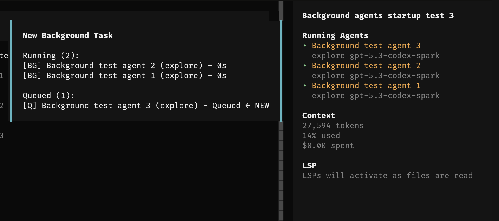

# opencode-sidebar-background-sessions

OpenCode TUI plugin that shows running background sub-agents in the session sidebar.

It adds a `Running Agents` section above the normal sidebar content and lists background task agents while their sub-agent session is still busy. As a fallback, completed task entries are also removed once their matching `background_output` is collected.



## Installation

### For Humans

Copy and paste this prompt to your LLM agent (OpenCode, Claude Code, AmpCode, Cursor, etc.):

```text
Install and configure the OpenCode TUI plugin `opencode-sidebar-background-sessions` by following the instructions here:
https://raw.githubusercontent.com/dnaroid/opencode-sidebar-background-sessions/main/docs/guide/installation.md
```

Or read the [Installation Guide](docs/guide/installation.md), but letting an agent edit the config is safer.

### For LLM Agents

Fetch the installation guide and follow it:

```bash
curl -s https://raw.githubusercontent.com/dnaroid/opencode-sidebar-background-sessions/main/docs/guide/installation.md
```

### Manual install

This is an OpenCode TUI plugin. It belongs in `tui.json`, not `opencode.json`.

Add the npm package name to your TUI config:

- **macOS / Linux**: `~/.config/opencode/tui.json`
- **Windows**: `%APPDATA%\opencode\tui.json`

```jsonc
{
  "$schema": "https://opencode.ai/tui.json",
  "plugin": ["opencode-sidebar-background-sessions"],
}
```

Restart OpenCode after installing. When background task agents are running, the sidebar shows a `Running Agents` section above the normal sidebar content.

Do not use `opencode plugin -g` for this package if your OpenCode version writes plugin entries to `opencode.json`; that command is for server plugins, while this package is loaded by the TUI plugin runtime.

## Local development install

From this package directory:

```bash
bun install
bun run build
```

Then point OpenCode at the package root — it will resolve the `./tui` export from `package.json` automatically:

```jsonc
// ~/.config/opencode/tui.json  (macOS/Linux)
// %APPDATA%\opencode\tui.json  (Windows)
{
  "plugin": ["/absolute/path/to/opencode-sidebar-background-sessions"],
}
```

## Notes

- This is a TUI plugin, so it is configured in `tui.json`, not `opencode.json`.
- The normal OpenCode Status dialog lists server plugins; TUI plugins may not appear there.
- The plugin intentionally does not mutate session titles. It reads the current TUI session state and renders only in the sidebar.
